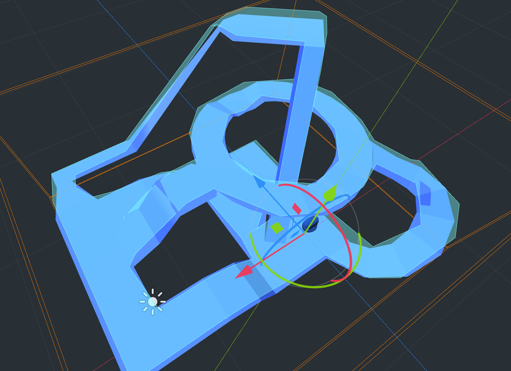
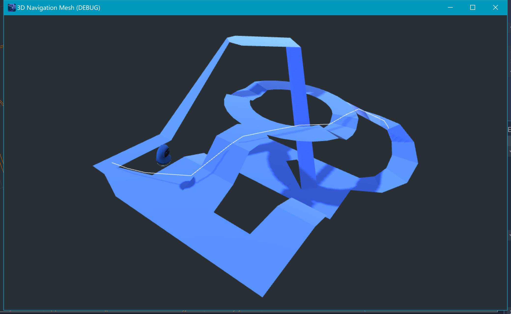

NavMesh是对于最常用的寻路系统，几乎所有现代的游戏引擎中的寻路系统都基于它。Nav即Navigation，Mesh即为网格，它是一种基于网格的寻路系统。这里的网格是凸多边形网格。代数课及离散数学中学习过，凸集对于加法是封闭的，因此凸集中任何两个点所连线段中的任何点都必然存在于凸集中，对于凸多边形亦是如此。因此对于复杂的三维场景中的寻路系统，最容易想到的就是把场景划分为多个凸多边形（任何凹多边形都可以通过算法划分为多个凸多边形）。之后根据Agent目的地和当前位置计算出每个凸多边形内应走的最短距离，最后将它们连线即可。

需要注意的是，NavMesh在每个凸多边形内是最优的，但对于多个凸边形连成的复杂网格，NavMesh并非一定是是最优的（代价最小的）寻路算法。比如对于连续的U形弯，Agent并非一定压着最内圈行走（取决于弯道处凸多边形划分的数目，多边形划分得越多，压得越近。

下图中场景地形上面铺的一层绿色的网格为寻路的NaviMeshSurface网格。

下图中白色的线即为Agent寻路时所走的路线，



NavMesh的构建，可以预先烘焙到一个表中，利用空间换时间，因此在运行时只需要O(V)的时间复杂度。Godot中的构建NavMesh相关的代码如下(navigation.cpp)

```C++
void Navigation::_navmesh_link(int p_id) {

	ERR_FAIL_COND(!navmesh_map.has(p_id));
	NavMesh &nm = navmesh_map[p_id];
	ERR_FAIL_COND(nm.linked);
	ERR_FAIL_COND(nm.navmesh.is_null());

	PoolVector<Vector3> vertices = nm.navmesh->get_vertices();
	int len = vertices.size();
	if (len == 0)
		return;

	PoolVector<Vector3>::Read r = vertices.read();

	for (int i = 0; i < nm.navmesh->get_polygon_count(); i++) {

		//build

		List<Polygon>::Element *P = nm.polygons.push_back(Polygon());
		Polygon &p = P->get();
		p.owner = &nm;

		Vector<int> poly = nm.navmesh->get_polygon(i);
		int plen = poly.size();
		const int *indices = poly.ptr();
		bool valid = true;
		p.edges.resize(plen);

		Vector3 center;
		float sum = 0;

		for (int j = 0; j < plen; j++) {

			int idx = indices[j];
			if (idx < 0 || idx >= len) {
				valid = false;
				break;
			}

			Polygon::Edge e;
			Vector3 ep = nm.xform.xform(r[idx]);
			center += ep;
			e.point = _get_point(ep);
			p.edges.write[j] = e;

			if (j >= 2) {
				Vector3 epa = nm.xform.xform(r[indices[j - 2]]);
				Vector3 epb = nm.xform.xform(r[indices[j - 1]]);

				sum += up.dot((epb - epa).cross(ep - epa));
			}
		}

		p.clockwise = sum > 0;

		if (!valid) {
			nm.polygons.pop_back();
			ERR_CONTINUE(!valid);
		}

		p.center = center;
		if (plen != 0) {
			p.center /= plen;
		}

		//connect

		for (int j = 0; j < plen; j++) {

			int next = (j + 1) % plen;
			EdgeKey ek(p.edges[j].point, p.edges[next].point);

			Map<EdgeKey, Connection>::Element *C = connections.find(ek);
			if (!C) {

				Connection c;
				c.A = &p;
				c.A_edge = j;
				c.B = NULL;
				c.B_edge = -1;
				connections[ek] = c;
			} else {

				if (C->get().B != NULL) {
					ConnectionPending pending;
					pending.polygon = &p;
					pending.edge = j;
					p.edges.write[j].P = C->get().pending.push_back(pending);
					continue;
				}

				C->get().B = &p;
				C->get().B_edge = j;
				C->get().A->edges.write[C->get().A_edge].C = &p;
				C->get().A->edges.write[C->get().A_edge].C_edge = j;
				p.edges.write[j].C = C->get().A;
				p.edges.write[j].C_edge = C->get().A_edge;
				//connection successful.
			}
		}
	}

	nm.linked = true;
}
```

而Godot中用于寻路的算法代码如下：

```C++
Vector3 Navigation::get_closest_point_to_segment(const Vector3 &p_from, const Vector3 &p_to, const bool &p_use_collision) {

	bool use_collision = p_use_collision;
	Vector3 closest_point;
	float closest_point_d = 1e20;

	for (Map<int, NavMesh>::Element *E = navmesh_map.front(); E; E = E->next()) {

		if (!E->get().linked)
			continue;
		for (List<Polygon>::Element *F = E->get().polygons.front(); F; F = F->next()) {

			Polygon &p = F->get();
			for (int i = 2; i < p.edges.size(); i++) {

				Face3 f(_get_vertex(p.edges[0].point), _get_vertex(p.edges[i - 1].point), _get_vertex(p.edges[i].point));
				Vector3 inters;
				if (f.intersects_segment(p_from, p_to, &inters)) {

					if (!use_collision) {
						closest_point = inters;
						use_collision = true;
						closest_point_d = p_from.distance_to(inters);
					} else if (closest_point_d > inters.distance_to(p_from)) {

						closest_point = inters;
						closest_point_d = p_from.distance_to(inters);
					}
				}
			}

			if (!use_collision) {

				int edge_count = p.edges.size();
				for (int i = 0; i < edge_count; i++) {

					Vector3 a, b;
					int next = (i + 1) % edge_count;
					Geometry::get_closest_points_between_segments(p_from, p_to, _get_vertex(p.edges[i].point), _get_vertex(p.edges[next].point), a, b);

					float d = a.distance_to(b);
					if (d < closest_point_d) {

						closest_point_d = d;
						closest_point = b;
					}
				}
			}
		}
	}

	return closest_point;
}
```

